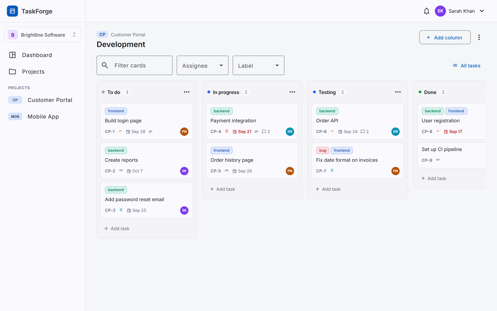
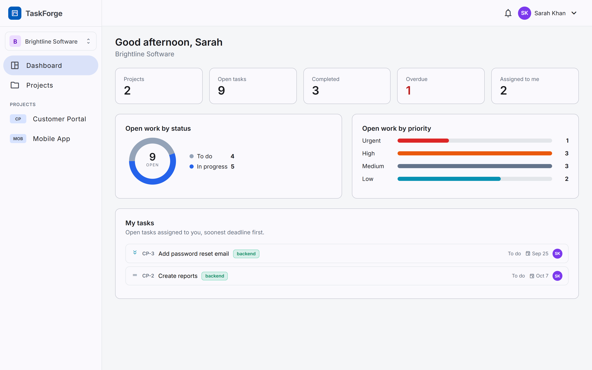
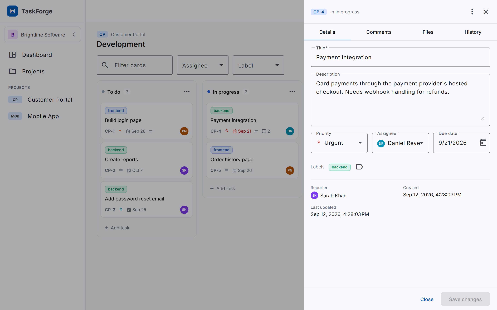
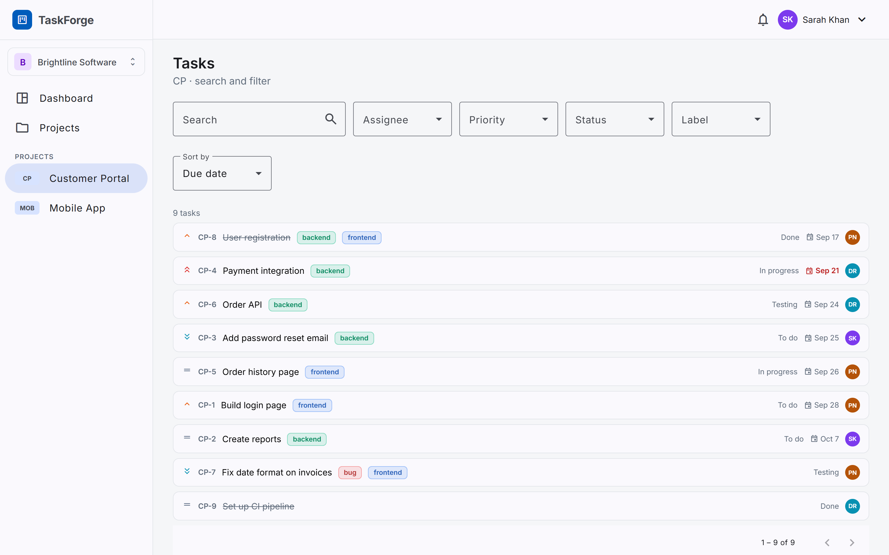
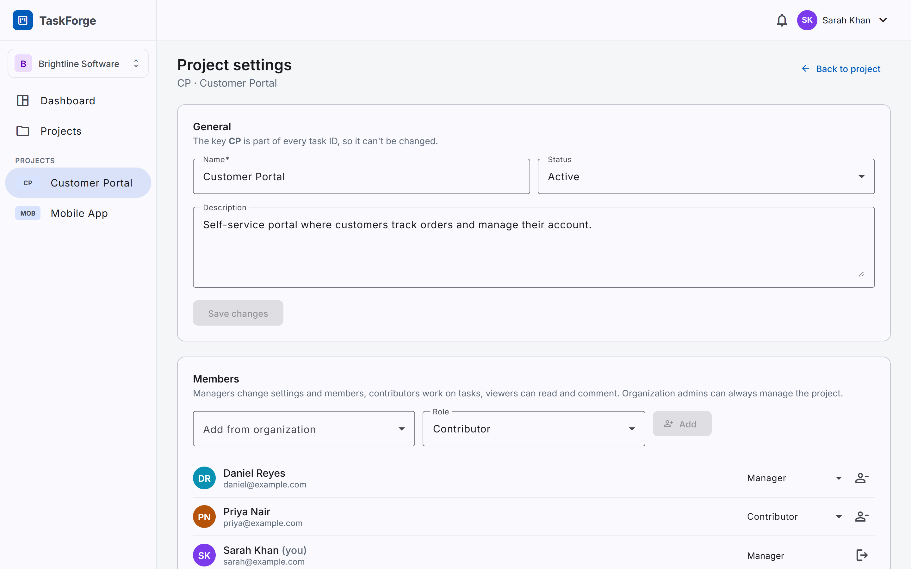
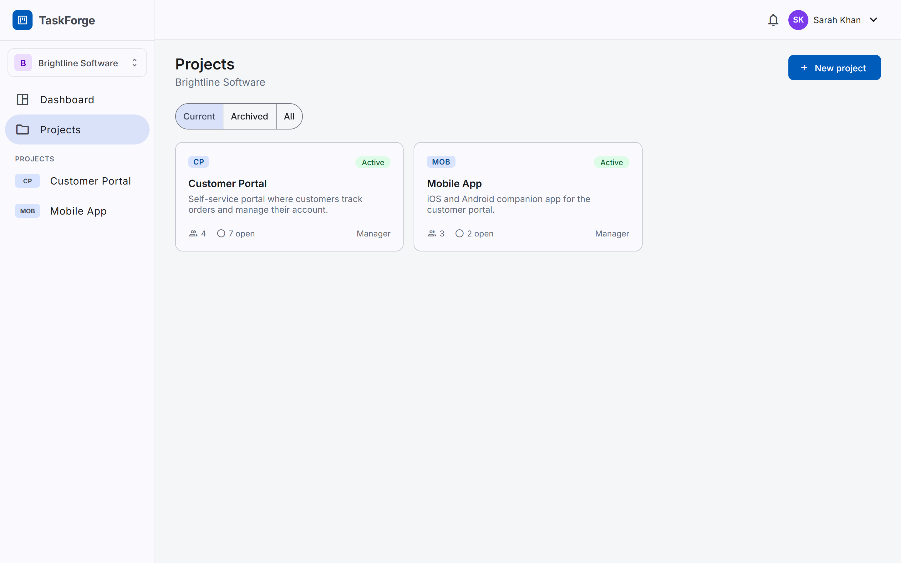
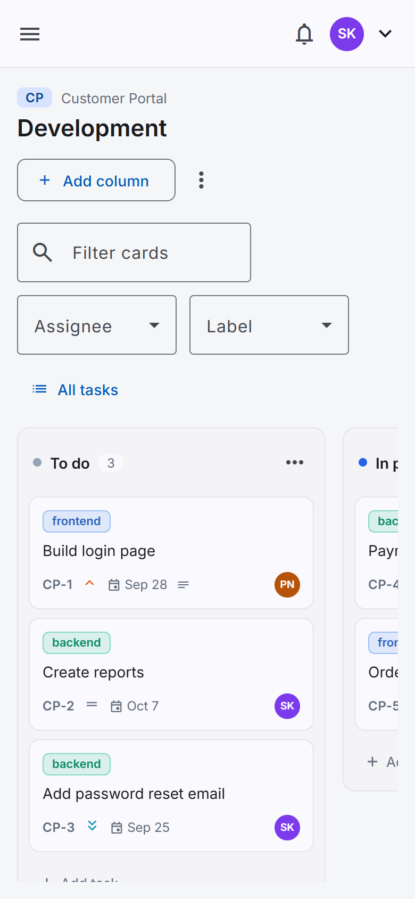
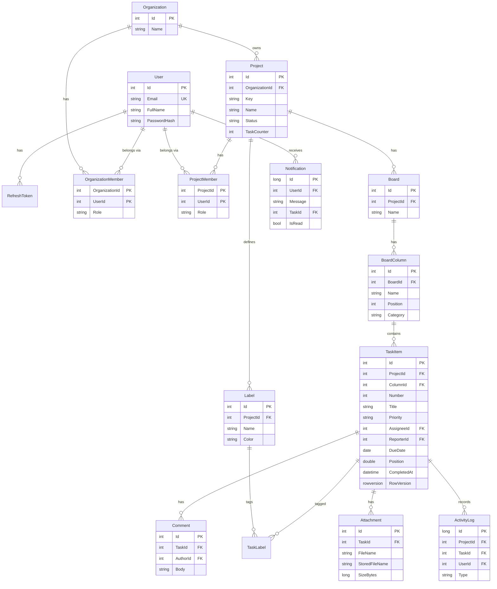

# TaskForge

[](https://github.com/nurullah25/TaskForge/actions/workflows/ci.yml)

TaskForge is a project and task management app for small teams. Work is organized into organizations, projects and kanban boards, and changes made by one person appear for everyone viewing the same board without a refresh.

It is a full-stack sample built to be read: an ASP.NET Core Web API with EF Core and SQL Server, an Angular client, and SignalR for the live updates.



## Contents

- [Features](#features)
- [Screenshots](#screenshots)
- [Technology](#technology)
- [Architecture](#architecture)
- [Database design](#database-design)
- [API](#api)
- [Roles and permissions](#roles-and-permissions)
- [Getting started](#getting-started)
- [Testing](#testing)
- [Design decisions worth explaining](#design-decisions-worth-explaining)
- [Future improvements](#future-improvements)

## Features

**Accounts** — registration and sign-in with JWT access tokens, rotating refresh tokens in an `HttpOnly` cookie, and sign-out that revokes the session.

**Organizations and projects** — organizations hold projects, each with members and roles. Projects have a key (`CP`) that becomes part of every task id (`CP-12`), a status, labels and settings.

**Boards** — every project starts with a board of four columns. Columns can be renamed, added, reordered by dragging and deleted, and a project can have several boards.

**Tasks** — title, description, assignee, reporter, priority, due date, labels, comments, attachments and a full history. Cards are dragged within and between columns; a project-wide task list adds filtering, sorting and paging.

**Collaboration** — comments (editable by their author), file attachments, and an activity history per task and per project.

**Live updates** — moving, creating, editing or deleting a task updates every other browser looking at that board, and notifications arrive as they happen.

**Dashboard** — open, completed and overdue work for the selected organization, what is assigned to you, and two small charts.

## Screenshots

| | |
|---|---|
|  **Dashboard** |  **Task details** |
|  **Filtering** |  **Project settings** |
|  **Projects** |  **On a phone** |

## Technology

| Area | Used |
|---|---|
| API | C#, .NET 8, ASP.NET Core Web API, Entity Framework Core 8, SQL Server, SignalR, Serilog, Swagger |
| Client | Angular 21 (standalone components, signals, zoneless), TypeScript, RxJS, Angular Material, Angular CDK drag and drop |
| Tests | xUnit, `WebApplicationFactory` integration tests against SQL Server, Vitest |
| Tools | Visual Studio, VS Code, SQL Server Management Studio, Git, Postman |

## Architecture

```
Angular SPA ──HTTP (JWT)──▶ ASP.NET Core Web API ──EF Core──▶ SQL Server
     ▲                          │
     └──── SignalR (/hubs/app) ◀┘   board events and notifications
```

```
server/TaskForge.Api/
├── Common/          exceptions, error handler, access checks, paging
├── Data/            DbContext, entity configurations, migrations, demo data
├── Entities/        the database model
├── Features/        one folder per feature: controller + service + DTOs
│   ├── Auth/ Organizations/ Projects/ Boards/ Tasks/ Labels/
│   └── Comments/ Attachments/ Activity/ Notifications/ Dashboard/
├── Realtime/        SignalR hub and the code that broadcasts board changes
└── Storage/         file storage behind one interface
client/src/app/
├── core/            auth, http interceptors, layout, realtime, workspace state
├── shared/          reusable components and pipes
├── auth/ dashboard/ organizations/ projects/ boards/ tasks/ labels/ notifications/
```

**The API is one project organized by feature**, not four projects in layers. Controllers stay thin and call a service; services use `DbContext` directly and project straight into DTOs, so entities never leave the API. There is no repository layer, because `DbContext` already is one and hiding it costs more than it gives. Interfaces are added only where something really varies — file storage is the only one.

**The client uses signals for state and RxJS for streams.** Each feature has a small service; the board page provides a `BoardStore` that holds the open board and applies both local edits and live events. No state management library: the only complex state is one board, and a store service covers it.

## Database design



**Membership tables are explicit** (`OrganizationMember`, `ProjectMember`, `TaskLabel`) because they carry data such as the role, and their composite keys stop the same membership existing twice.

**`TaskItem.ProjectId` is stored even though it can be reached** through Column → Board → Project. Filtering, permission checks and the dashboard then need no joins.

**Indexes** match real queries: `Users(Email)` unique for sign-in, `Tasks(ColumnId, Position)` for loading a board in order, `Tasks(ProjectId, Number)` unique for task keys, `Tasks(ProjectId, AssigneeId)` and `Tasks(ProjectId, DueDate)` for filters, `Notifications(UserId, IsRead, CreatedAt)` for the unread badge, and `(TaskId, CreatedAt)` on comments and history for their timelines.

**Deletes are explicit.** SQL Server rejects a table reachable by two cascade paths, so only true children cascade (memberships, a board's columns, a task's comments, labels and attachments). Tasks, projects and organizations are deleted in services, in the right order, inside a transaction.

## API

All endpoints require a valid access token unless marked otherwise. Swagger UI is at `/swagger` in development, and `docs/TaskForge.postman_collection.json` is a ready-made Postman collection (run "Sign in" first; it stores the token for the other requests).

| Area | Endpoints |
|---|---|
| Auth | `POST /api/auth/register` · `POST /api/auth/login` · `POST /api/auth/refresh` · `POST /api/auth/logout` · `GET /api/auth/me` |
| Organizations | `GET/POST /api/organizations` · `GET/PUT/DELETE /api/organizations/{id}` · `GET/POST /api/organizations/{id}/members` · `PUT/DELETE /api/organizations/{id}/members/{userId}` |
| Projects | `GET/POST /api/organizations/{orgId}/projects` · `GET/PUT/DELETE /api/projects/{id}` · `GET/POST /api/projects/{id}/members` · `PUT/DELETE /api/projects/{id}/members/{userId}` |
| Labels | `GET/POST /api/projects/{id}/labels` · `PUT/DELETE /api/labels/{id}` · `PUT /api/tasks/{id}/labels` |
| Boards | `GET/POST /api/projects/{projectId}/boards` · `GET/PUT/DELETE /api/boards/{id}` |
| Columns | `POST /api/boards/{id}/columns` · `PUT /api/boards/{id}/columns/order` · `PUT/DELETE /api/columns/{id}` |
| Tasks | `GET /api/projects/{projectId}/tasks` (filters, sorting, paging) · `POST /api/tasks` · `GET/PUT/DELETE /api/tasks/{id}` · `POST /api/tasks/{id}/move` |
| Comments | `GET/POST /api/tasks/{id}/comments` · `PUT/DELETE /api/comments/{id}` |
| Attachments | `GET/POST /api/tasks/{id}/attachments` · `GET /api/attachments/{id}/download` · `DELETE /api/attachments/{id}` |
| History | `GET /api/tasks/{id}/activity` · `GET /api/projects/{id}/activity` |
| Notifications | `GET /api/notifications` · `GET /api/notifications/unread-count` · `POST /api/notifications/{id}/read` · `POST /api/notifications/read-all` |
| Dashboard | `GET /api/dashboard?organizationId=` |
| Hub | `/hubs/app` — client calls `JoinBoard` / `LeaveBoard`; server sends `TaskCreated`, `TaskUpdated`, `TaskMoved`, `TaskDeleted`, `ColumnsChanged`, `NotificationReceived` |

**Status codes**: `200` read or update · `201` created · `204` deleted · `400` validation · `401` missing or expired token · `403` no permission · `404` not found, also used for things you may not see, so ids can't be probed · `409` conflict, including "someone else edited this first" · `413` file too large.

Errors are RFC 7807 `ProblemDetails` with a `traceId` that also appears in the logs:

```json
{
  "type": "https://tools.ietf.org/html/rfc9110#section-15.5.10",
  "title": "Conflict",
  "status": 409,
  "detail": "This item was changed by someone else. Reload it and try again.",
  "traceId": "00-9f2c…-00"
}
```

## Roles and permissions

Roles live in the database, not in the token, so a change takes effect on the next request.

| Organization role | Can |
|---|---|
| Owner | Everything, including deleting the organization and managing owners |
| Admin | Manage members and projects; counts as manager of every project |
| Member | See the organization and the projects they belong to |

| Project role | Can |
|---|---|
| Manager | Project settings, members, boards, columns and labels |
| Contributor | Create, edit and move tasks; delete their own; comment |
| Viewer | Read and comment |

## Getting started

### Prerequisites

- .NET SDK 8 or later (the API targets `net8.0`)
- Node.js 22.12 or later
- SQL Server or SQL Server LocalDB

### Run the API

```bash
cd server/TaskForge.Api
dotnet run
```

The API listens on `http://localhost:5080`, with Swagger UI at `/swagger`. In development it applies migrations on startup and fills an empty database with a demo workspace. The connection string is in `appsettings.json`.

Demo accounts, all with password `Demo@1234`:

| Email | Role |
|---|---|
| sarah@example.com | Organization owner |
| daniel@example.com | Organization admin, project manager |
| priya@example.com | Member, contributor |
| tom@example.com | Member, viewer on Customer Portal |

The JWT signing key for development is in `appsettings.Development.json`. In any other environment the API refuses to start until `Jwt:Key` is set, for example through the `Jwt__Key` environment variable.

### Run the client

```bash
cd client
npm install
npm start
```

Open `http://localhost:4200`. Requests to `/api` and `/hubs` are proxied to the API (`client/proxy.conf.json`), so the two run same-origin and no CORS setup is needed.

### Database changes

```bash
dotnet tool restore
dotnet ef migrations add <Name> --project server/TaskForge.Api --output-dir Data/Migrations
```

## Testing

```bash
dotnet test
```

```bash
cd client
npm test
```

**78 API tests** run the real application in memory with `WebApplicationFactory` against a `TaskForge_Tests` database that is recreated on each run. SQL Server is used rather than EF's in-memory provider because the tests rely on real constraints, cascade rules, `rowversion` conflicts and transactions. Set `TASKFORGE_TEST_DB` to point them at another server. The realtime tests open genuine SignalR connections and wait for events.

**24 client tests** cover the pieces where a mistake is easy and invisible: the token refresh interceptor, route guards, the board store's optimistic moves and rollback, error message formatting and relative times.

Both suites run in GitHub Actions on every push, the API tests against a SQL Server service container.

## Design decisions worth explaining

**Task ordering.** Cards have a `Position` number rather than an index. When a card is dropped the client sends the cards it landed **between**, and the server gives it the midpoint of their positions, so a move updates one row and is still correct if someone else rearranged the column a second earlier. When repeated drops in one spot exhaust the gap, the column is spread out evenly again.

**Two kinds of concurrency.** Editing a task is checked with SQL Server's `rowversion`: the second save gets a `409` and the panel offers to load the other version. Task numbers come from a counter on the project that is a concurrency token, so two tasks created at the same moment can't both become `CP-7`.

**Status is the column.** Columns carry a category (To do / In progress / Done) separate from their name, so teams can rename columns freely while the dashboard still knows what counts as finished.

**Where the tokens live.** The access token is kept in memory only; the refresh token is an `HttpOnly`, `Secure`, `SameSite=Strict` cookie limited to `/api/auth`, so page scripts can't read it. One shared refresh call serves all requests that expire at once.

**Real-time without echoes.** Events are sent after `SaveChanges`, to the group of the board being viewed, and the browser that made the change is excluded by the connection id it passes in a header — it already updated itself.

**One JSON shape.** SignalR serializes separately from the API. Until that was aligned, the hub sent `priority: 3` while the API sent `"High"`, which broke rendering. A test now inspects the raw hub payload.

## Future improvements

- Refresh token reuse detection (revoke every session when an old token reappears), left out because two tabs refreshing at once would sign the user out.
- Email delivery for invitations and notifications; invite people who don't have an account yet.
- Move attachments to blob storage — `IFileStorage` exists for exactly this.
- Board WIP limits, swimlanes, sprints and time tracking.
- Rate limiting on sign-in, and refresh token cleanup for expired rows.
- Server-side filtering on the board itself for very large projects, and virtual scrolling in long columns.
- More client tests around the task panel, and end-to-end tests for the drag-and-drop flow.

## License

[MIT](LICENSE)
